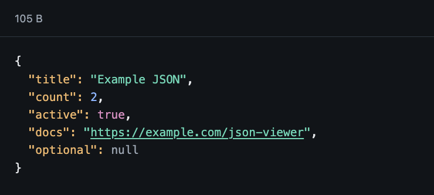

# JSON View - Chrome Extension


Chrome extension built with WXT. It prettifies the top-level browser document
only when the response MIME type is `application/json`.



Mock JSON endpoint:

https://jsonplaceholder.typicode.com/todos/1

## Architecture

Current extension parts:

- `@jview/extension`: WXT extension shell, content script, popup entrypoint, and JSON page rendering bootstrap.
- `@jview/view`: JSON rendering UI and token/link highlighting.
- `@jview/popup`: popup settings UI.
- `@jview/storage`: storage context and browser storage strategy.
- `@jview/definitions`: shared `UserSettings` schema and type.
- `@jview/tests`: tests

There is no background script or service worker.

## Development

You can run following commands in the root.

```sh
npm run dev
```

## Build

```sh
npm run build
```

# ToDo

* Add knip
